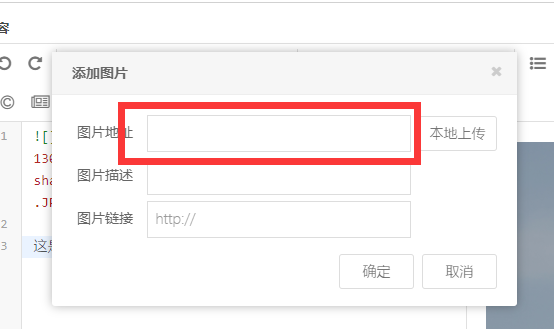
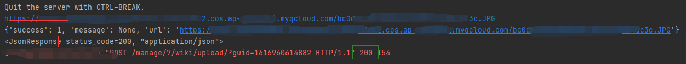
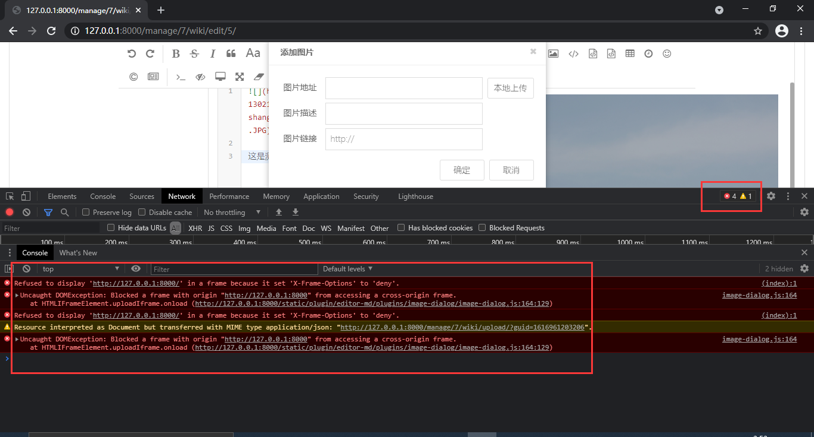
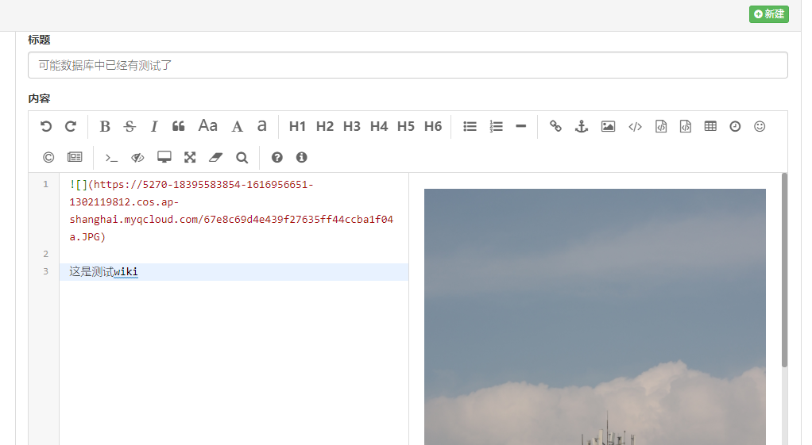

## 问题描述:Django框架写网页项目时，用到插件[editor.md](http://editor.md.ipandao.com/)实现网页端富文本编辑器，实现图片跨域上传时，返回Json值成功，但MarkDown编辑器中没有图片





> 上传成功但没有显示图片地址

浏览器F12打开调试模式后发现异常


报错如下：
```
Refused to display 'http://127.0.0.1:8000/' in a frame because it set 'X-Frame-Options' to 'deny'.
```
由于借用的是开源模板，而且图片使用的是跨域上传方式，将文件存放在腾讯云平台cos中，搜索查询到的问题是frame架构中间人攻击的相关bug，在谷歌上找到线索，问题原因：（官方文档的答案）

clickjacking中间件和装饰器提供了易于使用的保护，以防止clickjacking。当恶意站点诱使用户单击他们已加载到隐藏框架或iframe中的另一个站点的隐藏元素时，会发生这种类型的攻击。

现代浏览器采用X-Frame-Options HTTP标头，该标头指示是否允许在框架或iframe中加载资源。如果响应包含标头值为的标头，SAMEORIGIN则浏览器将仅在请求源自同一站点的情况下将资源加载到框架中。如果将标头设置为，DENY则无论哪个站点发出请求，浏览器都将阻止资源加载到框架中。

Django提供了几种在您的网站响应中包含此标头的方法：

1. 在所有响应中设置标头的中间件。
2. 一组视图装饰器，可用于覆盖中间件或仅为某些视图设置标头。

如果X-Frame-OptionsHTTP头尚未在响应中出现，则仅由中间件或视图装饰器设置。

在Django 3.0中进行了更改：

设置的默认值X_FRAME_OPTIONS从更改SAMEORIGIN为DENY

出现问题的原因在setting中的中间件：

```
MIDDLEWARE = [
    'django.middleware.security.SecurityMiddleware',
    'django.contrib.sessions.middleware.SessionMiddleware',
    'django.middleware.common.CommonMiddleware',
    'django.middleware.csrf.CsrfViewMiddleware',
    'django.contrib.auth.middleware.AuthenticationMiddleware',
    'django.contrib.messages.middleware.MessageMiddleware',
    'django.middleware.clickjacking.XFrameOptionsMiddleware',
]
```
## 解决方法
- 注释掉中间件，但这样容易遭受中间人攻击
- 在view视图中添加装饰器

```
from django.views.decorators.csrf import csrf_exempt
from django.views.decorators.clickjacking import xframe_options_exempt


# 网页中无法添加csrf token， 可在view函数处添加装饰器csrf_exempt(存放于包django.views.decorators.csrf中)

@xframe_options_exempt
@csrf_exempt
def wiki_upload(request, project_id):
    """
    markdown插件上传图片
    """
    result = {
        'success': 0,
        'message': None,
        'url': None,
    }

    image_object = request.FILES.get('editormd-image-file')
    if not image_object:
        result['message'] = "文件不存在"
        return JsonResponse(result)

    ext = image_object.name.rsplit('.')[-1]  # 获取文件后缀名
    key = "{}.{}".format(uid(request.tracer.user.mobile_phone), ext)

    # 文件对象上传到当前项目的桶中
    image_url = upload_file(
        bucket=request.tracer.project.bucket,
        region=request.tracer.project.region,
        file_object=image_object,
        key=key,
    )
    print(image_url)

    result = {
        'success': 1,
        'message': None,
        'url': image_url,
    }
    print(result)
    print(JsonResponse(result))
    return JsonResponse(result)
```

- 在settings中设置X_FRAME_OPTIONS = 'SAMEORIGIN'

## 解决后


可以正常上传

