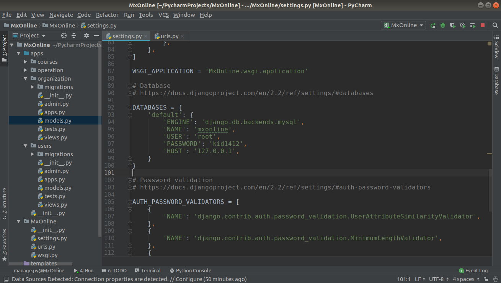
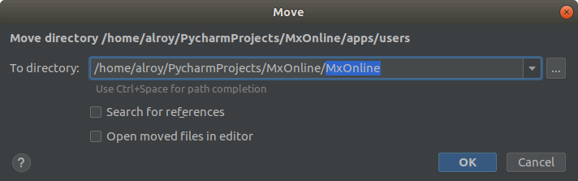

## Models的相关问题

1. 先执行命令创建四个app
 ```
   python manage.py startapp courses
   python manage.py startapp users
   python manage.py startapp operation
   python manage.py startapp organization
   ```
   修改settings.py中INSTALLED_APPS模块,注册四个app
```
INSTALLED_APPS = [
    'django.contrib.admin',
    'django.contrib.auth',
    'django.contrib.contenttypes',
    'django.contrib.sessions',
    'django.contrib.messages',
    'django.contrib.staticfiles',
    'courses',
    'operation',
    'organization',
    'users',
    'xadmin',
    'crispy_forms',
]


```

 创建UserProfile模型时,继承了AbstractUser类(`from django.contrib.auth.models import AbstractUser`)

使用此类时需要在settings.py中添加一行代码

> AUTH_USER_MODEL = 'users.UserProfile' 
users是app的名字,UserProfile是users中models.py中类的名称

2. 在models.py中定义类时,使用到外键,需要添加`on_delete=models.CASCADE` 来约束外键删除,

3. 连接数据库:
    - 先修改settings.py中的配置,
    
    NAME是MySQL中database的名字, USER是数据库用户名,PASSWORD是数据库密码,
    - 安装mysqlclient, 在pycharm中安装或者使用相应的包管理器安装,
    - 执行
    ```
    python manage.py makemigrations
    python manage.py migrate
    ```
    迁移数据库.

4. 为了防止项目结构混乱,在根目录下建一个Python Package,将四个文件全部拖如文件中 
 两个复选框全部取消勾选,移动完成后会有一些包导入时路径不对,将apps右键 --> Mark Directory as --> sources root ,此时在Pycharm中run这个项目不会出现问题,在命令行中运行会因为根目录不正确出现错误.
 ```
(base)  alroy@Alan  ~/PycharmProjects/RBQ  python manage.py runserver        
Unhandled exception in thread started by <function check_errors.<locals>.wrapper at 0x7f557788fd90>
Traceback (most recent call last):
  File "/home/alroy/anaconda3/lib/python3.7/site-packages/django/utils/autoreload.py", line 225, in wrapper
    fn(*args, **kwargs)
  File "/home/alroy/anaconda3/lib/python3.7/site-packages/django/core/management/commands/runserver.py", line 109, in inner_run
    autoreload.raise_last_exception()
  File "/home/alroy/anaconda3/lib/python3.7/site-packages/django/utils/autoreload.py", line 248, in raise_last_exception
    raise _exception[1]
  File "/home/alroy/anaconda3/lib/python3.7/site-packages/django/core/management/__init__.py", line 337, in execute
    autoreload.check_errors(django.setup)()
  File "/home/alroy/anaconda3/lib/python3.7/site-packages/django/utils/autoreload.py", line 225, in wrapper
    fn(*args, **kwargs)
  File "/home/alroy/anaconda3/lib/python3.7/site-packages/django/__init__.py", line 24, in setup
    apps.populate(settings.INSTALLED_APPS)
  File "/home/alroy/anaconda3/lib/python3.7/site-packages/django/apps/registry.py", line 89, in populate
    app_config = AppConfig.create(entry)
  File "/home/alroy/anaconda3/lib/python3.7/site-packages/django/apps/config.py", line 90, in create
    module = import_module(entry)
  File "/home/alroy/anaconda3/lib/python3.7/importlib/__init__.py", line 127, in import_module
    return _bootstrap._gcd_import(name[level:], package, level)
  File "<frozen importlib._bootstrap>", line 1006, in _gcd_import
  File "<frozen importlib._bootstrap>", line 983, in _find_and_load
  File "<frozen importlib._bootstrap>", line 965, in _find_and_load_unlocked
ModuleNotFoundError: No module named 'users'

 ```

在根目录的settings.py中添加两行代码
```
import sys
sys.path.insert(0,os.path.join(BASE_DIR, 'apps'))
```
`sys.path.insert(0,os.path.join(BASE_DIR, 'apps'))`定义搜索路径的优先顺序，序号从0开始，表示最大优先级，`sys.path.insert()`加入的也是临时搜索路径，程序退出后失效。

## 安装xadmin

1. xadmin的优点见[官网](http://sshwsfc.github.io/xadmin) 


这部分搞了半天,忘记去[Google](www.google.com)了,解决之后才发现自己很**,
我安装方法是 直接`conda install -n django xadmin` 安装的是xadmin  0.6版本的,和Django2不兼容,运行会有各种神仙报错,就不贴截图了.
2. xadmin的[Github](https://github.com/sshwsfc/xadmin)上给了Django2的安装方法,看到官网有安装方法,心中更是一万匹***奔腾而过,切换到对应的环境中
`conda activate django`
> pip install git+git://github.com/shwsfc/xadmin.git@django2

## 配置用户上传media文件夹
在settings.py中添加这两行代码将media文件夹添加到项目路
径中,

`MEDIA_URL = '/media/'`

`MEDIA_ROOT = os.path.join(BASE_DIR, 'media')`

在TEMPLATES部分的OPTIONS中加入
`'django.template.context_processors.media',`
即可在前端中使用((MEDIA_URL))('('替换成{)来访问用户上传的文件

## 为每个app分配一个url

在根目录的urls.py中设置url指向到organization下的urls
文件,设置namespace为org,在organization下的urls中先
声明 app_name='org'
    
    url(r'^org/', include('organization.urls',namespace='org')),

将每个url设置name的好处,变更类名或者地址不需要修改前端页面的url配置(前端使用url方法`(%url 'org:test'%)`('('小括号替换为大括号))
