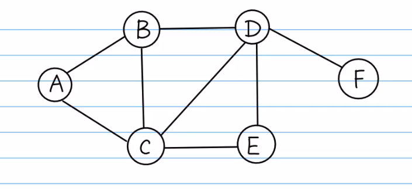

# 前言
> 广度优先搜索算法（英语：Breadth-First-Search，缩写为BFS），又译作宽度优先搜索，或横向优先搜索，是一种图形搜索算法。简单的说，BFS是从根节点开始，沿着树的宽度遍历树的节点。如果所有节点均被访问，则算法中止。


> 深度优先搜索算法（英语：Depth-First-Search，DFS）是一种用于遍历或搜索树或图的算法。沿着树的深度遍历树的节点，尽可能深的搜索树的分支。当节点v的所在边都己被探寻过，搜索将回溯到发现节点v的那条边的起始节点。这一过程一直进行到已发现从源节点可达的所有节点为止。如果还存在未被发现的节点，则选择其中一个作为源节点并重复以上过程，整个进程反复进行直到所有节点都被访问为止。属于盲目搜索。深度优先搜索是图论中的经典算法，利用深度优先搜索算法可以产生目标图的相应拓扑排序表，利用拓扑排序表可以方便的解决很多相关的图论问题，如最大路径问题等等
## 原理

### 广度优先搜索
1. 首先将根节点放入队列
2. 从队列中取出第一个节点,并检验它是否为目标.
    * 如果找到目标,则结束搜索并回传结果
    * 否则将它所有尚未检验过的直接子节点加入队列中.
3. 若队列为空,表示整张图都检查过了--亦即图中没有欲搜索的目标.结束搜索并回传“找不到目标”。
4. 重复步骤2.
5. 需要使用队列这一数据结构



假设以A为起点,与A点直接相连的点是 B,C ,此时广度优先遍历序列为A,B,C, 将BC入队,此时与B节点直接相连的是C和D,C已经在Queue中,所以下一个节点应是D,此时队列中为ABCD.与C节点相连的且未遍历过的节点为E, 所以将E入队,此时未遍历的节点为D,E, 与D直接相连的节点F入队即可得到广度优先遍历ABCDEF.


### 深度优先搜索
1. 首先将根节点放入队列中。
2. 从队列中取出第一个节点，并检验它是否为目标。   
    - 如果找到目标，则结束搜寻并回传结果。
    - 否则将它某一个尚未检验过的直接子节点加入队列中。
3. 重复步骤2。
4. 如果不存在未检测过的直接子节点。
    + 将上一级节点加入队列中。
    + 重复步骤2。
5. 重复步骤4。
6. 若队列为空，表示整张图都检查过了——亦即图中没有欲搜寻的目标。结束搜寻并回传“找不到目标”。
7. 需要使用栈这一数据结构


深度优先搜索过程:

深度优先搜索类似于树的先序遍历,正如其名称, 这种搜索算法所
遵循的搜索策略是尽可能"深"地搜索一个图, 它的基本思想:

假设以A为起点,然后由A出发,访问与A邻接且未被访问的任一顶
点B,再访问与B邻接且未被访问的顶点C,再访问与C邻接且未被访
问的顶点E......重复上述过程.当不能再继续向下访问时,依次
退回到最近被访问的顶点,若它还有邻接顶点未被访问过,则从该
点开始继续上述搜索过程,直到图中所有顶点均被访问过为止.一
般情况下,一个图的BFS和DFS不唯一.

# Python实现

## BFS

```
graph = {
    "A":["B", "C"],   # 与A相连的节点是B,C 
    "B":["A", "C", "D"], # 与B相连的节点是A,C,D
    "C":["A", "B", "D", "E"],
    "D":["B", "C", "E", "F"],
    "E":["C", "D"],
    "F":["D"]
 }

def BFS(graph, s):
    queue = []  # 初始化一个空队列
    queue.append(s) # 将所有节点入队列
    seen = set()
    seen.add(s)
    parent = {s : None}

    while(len(queue) > 0):
        vertex = queue.pop(0)
        nodes = graph[vertex]
        for w in nodes:
            if w not in seen:
                queue.append(w)
                seen.add(w)
                parent[w] = vertex
        print(vertex)
    return parent


parent = BFS(graph, "E")
for key in parent:
    print(key, parent[key])

```

## DFS

```
graph = {
    "A":["B", "C"],
    "B":["A", "C", "D"],
    "C":["A", "B", "D", "E"],
    "D":["B", "C", "E", "F"],
    "E":["C", "D"],
    "F":["D"]
 }

def DFS(graph, s):
    stack = []
    stack.append(s)
    seen = set()
    seen.add(s)
    while(len(stack) > 0):
        vertex = stack.pop()
        nodes = graph[vertex]
        for w in nodes:
            if w not in seen:
                stack.append(w)
                seen.add(w)
        print(vertex)

DFS(graph, "A")

```
